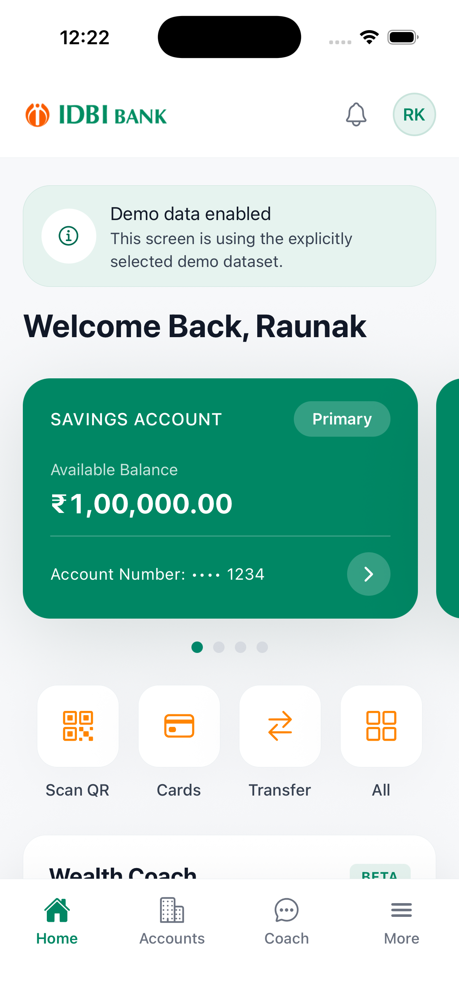
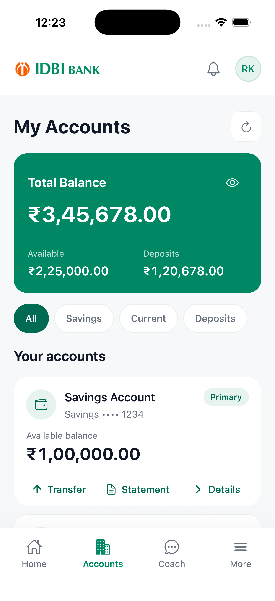
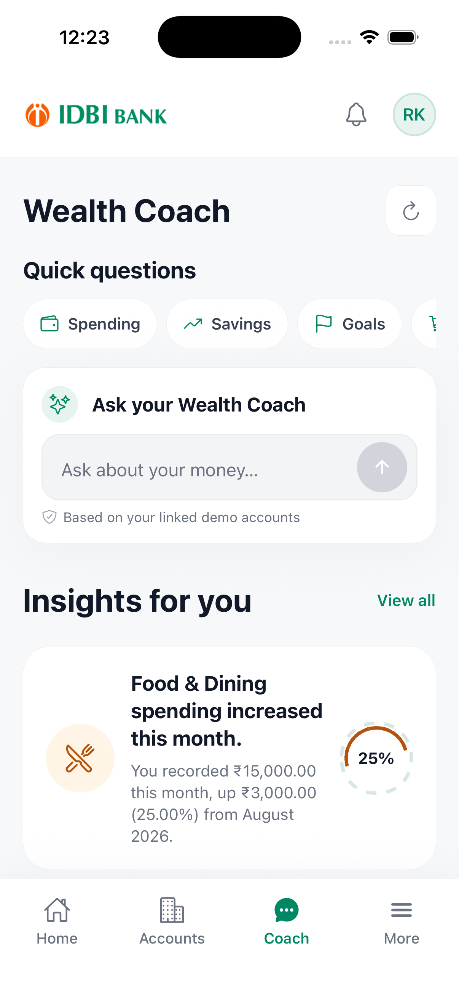

# IDBI Wealth Copilot

> An AI-powered personal wealth intelligence platform that brings accounts, transactions, financial insights, goals, and conversational guidance into one unified experience.

**IDBI Innovate 2026 — Digital Wealth Management**

## Try Wealth Copilot

| Resource | Link |
| --- | --- |
| Final app prototype | [Open the Appetize prototype](https://appetize.io/app/b_cyha5ltvmdh75x6brldhdghz4y) |
| GitHub repository | [RaunakKanoji/wealth-advisory](https://github.com/RaunakKanoji/wealth-advisory) |
| Local web experience | Run pnpm web from the repository root |
| API contracts | [docs/API_CONTRACTS.md](docs/API_CONTRACTS.md) |
| Demo readiness guide | [apps/banking/docs/DEMO_READINESS.md](apps/banking/docs/DEMO_READINESS.md) |

There is no separate hosted web URL configured in this repository. The browser experience is available through the local Expo web target.

## App Screenshots

These screenshots were captured from the working self-contained iOS Simulator build using the deterministic synthetic demo dataset. The complete interactive experience is available here:

[Launch the complete working app in Appetize →](https://appetize.io/app/b_cyha5ltvmdh75x6brldhdghz4y)

<table>
  <tr>
    <td></td>
    <td></td>
    <td></td>
  </tr>
  <tr>
    <td align="center"><strong>Home</strong> Balances, shortcuts, and demo data</td>
    <td align="center"><strong>Accounts</strong> Balances, deposits, and account actions</td>
    <td align="center"><strong>Wealth Coach</strong> Questions, insights, and guidance</td>
  </tr>
</table>

The full app also includes Activity, Cards, Transfers, QR payments, Notifications, Goals, Insights, Services, Profile, and support flows. See the [demo readiness guide](apps/banking/docs/DEMO_READINESS.md) for the recommended end-to-end navigation path.

## Overview

Wealth Copilot is a mobile-first banking and wealth intelligence experience for IDBI customers. It brings balances, linked accounts, cards, transactions, goals, financial insights, and an AI Wealth Coach into one place so users can move from raw financial activity to a clearer understanding of their money.

The product is designed for people whose financial lives span savings accounts, cards, deposits, expenses, savings plans, and longer-term goals. Instead of making users interpret each screen independently, Wealth Copilot provides a shared financial context across the dashboard, Accounts, Activity, Insights, Goals, and Coach experiences.

The Coach is intended for financial guidance and decision support. It is not a replacement for a regulated financial adviser, does not promise investment returns, and does not execute irreversible financial decisions.

## The Problem

Financial information is often fragmented across account balances, card activity, transaction histories, deposits, expenses, and goals. A conventional banking interface can show what happened without explaining the pattern behind it.

Users may still need to work out:

- which categories are driving their spending;
- whether their savings behaviour is improving;
- why expenses changed between periods;
- which transactions contributed to a trend; and
- how current behaviour affects a financial goal.

The challenge is therefore not simply displaying more data. It is turning financial data into understandable, contextual, and appropriately cautious information.

## Our Solution

Wealth Copilot adds a financial intelligence layer to a familiar banking experience:

~~~text
Financial data
      ↓
Data aggregation and normalization
      ↓
Owner-scoped financial intelligence
      ↓
AI Wealth Coach and deterministic analytics
      ↓
Insights, metrics, charts, and explanations
      ↓
Better-informed user decisions
~~~

Users can move between Home, Accounts, Activity, Cards, Insights, Goals, and Wealth Coach without losing the financial context used to answer a question.

## Core Features

### Unified financial dashboard

The Home experience brings together total balance, available-to-spend information, linked accounts, recent activity, financial highlights, shortcuts, and notifications. In remote mode, these values are loaded through the authenticated API rather than being read directly by the mobile client from the database.

### Accounts and balances

The Accounts experience supports account overviews, balance summaries, account detail views, statements, account activity, account actions, and the Account Aggregator connection entry point. The demo seed includes savings, current, fixed-deposit, and recurring-deposit examples.

### Transactions and activity

Users can browse account and card activity, open transaction details, search and filter activity, view merchant and category information, and distinguish completed, pending, failed, and reversed records where the data supports those states.

### Cards, payments, and transfers

The prototype includes cards, masked card details, card controls, blocking/status flows, card activity, beneficiaries, transfer drafts, review and submit states, transfer history, and QR-payment surfaces.

These are prototype banking flows. Transfers and payments are explicitly demo transactions: no real settlement, payment rail, OTP, or irreversible external side effect is implemented.

### Financial insights

The wealth area exposes financial summaries, spending observations, monthly snapshots, and insight cards. The analytics contract supports metric cards, category and merchant breakdowns, period comparisons, recurring-payment analysis, income and savings analysis, transaction evidence, and goal progress when the relevant data is available.

### Goals

Users can view wealth goals, open goal detail, review progress, and update a monthly contribution scenario. Goal calculations are presented as decision support; the app does not automatically transfer money or guarantee that a target will be reached.

### AI Wealth Coach

The Coach supports persisted conversations, consent, follow-up prompts, saved reports, answer sources, cancellation of in-flight runs, and financial questions grounded in the user-scoped context available to the service.

Example questions include:

- “How much did I spend on food this month?”
- “Show my biggest expenses.”
- “Why were my expenses higher this month?”
- “How much did I spend last week?”
- “How can I improve my savings?”
- “How am I progressing toward my goal?”

The answer path is:

~~~text
User question
      ↓
Consent and conversation context
      ↓
Supported query plan
      ↓
Owner-scoped financial data retrieval
      ↓
Verified calculations and evidence
      ↓
Validated explanation and follow-ups
      ↓
Text, metrics, charts, tables, and sources where supported
~~~

The API never accepts SQL, table names, or a client-supplied internal user ID from the mobile app. Query inputs are validated, financial records are scoped to the authenticated user, and model output is validated before it is persisted or returned.

## Personalised Financial Intelligence

The Coach context builder can use the authenticated user’s available account summary, balances, recent transactions, controlled transaction categories, active and historical goals, financial insights, and monthly snapshots. A question is therefore evaluated against bounded financial context rather than a generic answer template.

For example, generic guidance might explain common ways to save money. Contextual guidance can compare the user’s available spending records, identify a category or merchant pattern, show the period used, and point back to the supporting transactions. When records are incomplete, the response is expected to say so rather than treating missing data as zero activity.

Coach access is consent-aware. The API can ask for permission before using linked financial context, and consent can be revoked from the Coach experience.

## From Questions to Visual Insights

The structured Wealth Analytics response can contain:

- a concise answer and supporting detail;
- metric cards for income, expenses, net cash flow, counts, or goal values;
- bar, donut, line, stacked-bar, horizontal-bar, and progress chart data where applicable;
- transaction or merchant tables;
- evidence and data-freshness metadata; and
- read-only follow-up questions.

This makes the Coach a conversational interface for exploring financial data, not only a text chat surface. The mobile client renders the structured response when the analytics path is available.

## Financial Data Layer

### Demo and prototype data

The repository contains deterministic synthetic data for demonstrations and tests. The seeded development dataset includes:

- two demo users;
- four accounts for the primary demo user;
- ₹3,45,678 total ledger balance;
- ₹2,25,000 available to spend;
- 133 account transactions;
- cards, beneficiaries, transfers, notifications, goals, insights, snapshots, Coach conversations, and a 32-item service catalogue.

The Appetize build linked above is configured in apps/banking/eas.json for an explicit deterministic demo: mock data is enabled, demo authentication is enabled, and the remote Coach is disabled. It should be presented as synthetic prototype data, not as a live customer banking session.

### Backend-backed mode

For a connected development demo, set EXPO_PUBLIC_USE_MOCK_DATA=false and point EXPO_PUBLIC_API_BASE_URL at the Hono API. The request path is:

~~~text
Expo / React Native app
      │ Clerk bearer token or explicitly enabled demo header
      ▼
Hono API
      │ auth → validation → service → repository
      ▼
Drizzle ORM and Neon PostgreSQL
      ▼
Owner-scoped DTOs returned to the client
~~~

The API is the only process that reads DATABASE_URL. The mobile bundle receives a public API origin, never a database URL or server secret.

### Account Aggregator path

The backend and mobile client include an Account Aggregator consent, sync, webhook, normalization, and persistence path:

~~~text
Financial institution
      ↓
Consent and AA gateway
      ↓
ReBIT-compatible normalization
      ↓
Neon/PostgreSQL canonical accounts and transactions
      ↓
Wealth Copilot
~~~

The default adapter is configured for Finvu, with Setu, OneMoney, and an explicit mock provider available through server configuration. AA_ENABLED is false by default. A live provider connection still requires FIU onboarding, server-side credentials, registered signing keys, webhook configuration, and provider-specific encrypted FI data handling. The repository does not claim that live provider onboarding is complete.

For deterministic integration tests, the explicit mock AA provider is available when deliberately enabled. It is not a silent fallback for a failed live provider.

## AI Architecture

The application separates financial facts from model-generated language:

~~~mermaid
flowchart TD
    USER[User] --> APP[Expo Wealth Copilot]
    APP -->|Clerk token or demo auth| API[Hono API]
    API --> AUTH[Auth and consent]
    API --> DOMAIN[Banking and wealth services]
    DOMAIN --> DB[(Neon PostgreSQL)]
    API --> CONTEXT[Bounded context and query engine]
    CONTEXT --> GEMINI[Gemini REST model when configured]
    API --> GATEWAY[Internal analytics gateway]
    GATEWAY --> ANALYTICS[FastAPI Wealth Analytics]
    ANALYTICS --> VIEWS[(Read-only Neon analytics views)]
    ANALYTICS --> VANNA[Vanna 2 agent when explicitly enabled]
    GEMINI --> RESULT[Validated Coach response]
    ANALYTICS --> RESULT
    RESULT --> APP
~~~

### Gemini

The Node API includes a server-only GeminiCoachModel. When GEMINI_API_KEY and GEMINI_MODEL are configured, Gemini can help produce a bounded query plan and explain verified results. Requests use structured JSON response schemas, a configured fallback model can be used for selected provider failures, and the API rejects invalid or incomplete model responses.

Gemini is not called directly by the mobile app. The API supplies bounded context and does not give the model database credentials, unrestricted SQL access, or arbitrary write tools.

### Wealth Analytics and Vanna

apps/wealth-analytics is a private FastAPI service behind the Node API’s /api/wealth/query gateway. Its deterministic analytics engine owns the response contract for metrics, charts, tables, evidence, and recommendations. Vanna 2 agent wiring is available only when VANNA_ENABLE_AGENT=true; it is disabled by default and is constrained by a read-only SQL validator, a user-scoped database runner, and an internal service secret.

If the analytics service is configured, the Node API calls it after Coach consent is granted. If the analytics service is unavailable, the API can fall back to the owner-scoped Node Coach engine rather than exposing the internal analytics service to the client.

## Architecture

The repository is a pnpm workspace with a universal Expo client, a Node API, and an optional private Python analytics service.

| Layer | Implementation | Responsibility |
| --- | --- | --- |
| Mobile app | Expo SDK 54, React Native 0.81, Expo Router 6, TypeScript | iOS, Android, and local web experience |
| Client data | TanStack Query, typed API client, Zod-backed environment validation | Requests, caching, loading/error states, and view models |
| Authentication | Clerk Expo and Clerk backend verification | Production session authentication and user mapping |
| API | Hono on Node.js | Authenticated routes, validation, services, audit boundaries, and AI orchestration |
| Database | Neon PostgreSQL, Drizzle ORM, checked-in SQL migrations | User-scoped banking, wealth, Coach, consent, and audit data |
| Analytics | FastAPI, psycopg, deterministic Python analytics, optional Vanna 2 | Read-only structured financial analysis |
| AI provider | Gemini REST integration on the server | Optional query planning and explanation for the Coach |
| Quality | Jest / jest-expo, Vitest, TypeScript, Expo lint | Unit tests, API tests, and static checks |

## Repository Structure

~~~text
.
├── apps/
│   ├── banking/              Expo Router mobile and web client
│   │   ├── app/              Route files and navigation
│   │   ├── components/       Screens, cards, Coach UI, and design system
│   │   ├── lib/api/          Typed API client, hooks, query keys, view models
│   │   ├── services/         Demo and remote data services
│   │   ├── data/             Deterministic client fixtures
│   │   └── assets/branding/  IDBI app artwork and icons
│   ├── api/                  Hono / Node backend
│   │   ├── src/api/          Auth middleware and versioned routes
│   │   ├── src/services/     Banking, wealth, AA, and Coach services
│   │   ├── src/coach/        Query planning, verification, and model adapter
│   │   ├── src/db/           Drizzle schema, repositories, seed, and checks
│   │   └── drizzle/          Checked-in database migrations
│   └── wealth-analytics/     Private FastAPI analytics service
├── docs/                     Data, API, security, AA, Neon, and demo guides
├── package.json              Workspace commands
├── pnpm-workspace.yaml       Workspace definition
└── pnpm-lock.yaml            Locked dependency graph
~~~

## Running the Project Locally

### Prerequisites

- Node.js with Corepack enabled;
- pnpm 10, pinned by the root package.json;
- a development/demo Neon PostgreSQL branch for the API-backed flow;
- a Clerk application for authenticated mode; and
- Python 3 with virtual-environment support if the optional analytics service is used.

### Install dependencies

~~~bash
corepack enable
pnpm install
~~~

### Configure the API

Copy the server template into ignored local files and set the database connection. The API development scripts load .env.coach.local; migration and verification scripts also read .env.local.

~~~bash
cp apps/api/.env.example apps/api/.env.local
cp apps/api/.env.example apps/api/.env.coach.local
~~~

For a local backend-backed demo, set at least:

~~~text
DATABASE_URL=postgresql://...
DEMO_MODE=true
DEMO_USER_ID=usr_demo_a
DEMO_AUTH_ID=demo-customer-a
API_HOST=0.0.0.0
PORT=8080
~~~

Apply migrations and load only the synthetic demo rows into a development/demo branch:

~~~bash
pnpm db:migrate
pnpm db:seed
pnpm db:check
~~~

The seed intentionally replaces demo-owned rows. Do not run it against a production database containing real customer data.

### Configure the Expo client

~~~bash
cp apps/banking/.env.example apps/banking/.env.local
~~~

For the backend-backed demo, use a public API origin appropriate to the device and set:

~~~text
EXPO_PUBLIC_API_BASE_URL=http://127.0.0.1:8080
EXPO_PUBLIC_USE_MOCK_DATA=false
EXPO_PUBLIC_ALLOW_DEMO_AUTH=true
EXPO_PUBLIC_DEMO_AUTH_ID=demo-customer-a
EXPO_PUBLIC_REMOTE_COACH_ENABLED=true
EXPO_PUBLIC_CLERK_PUBLISHABLE_KEY=pk_test_...
~~~

On a physical device, replace 127.0.0.1 with the development computer’s reachable LAN IP and keep the API bound to 0.0.0.0. For a production/preview build, use a public HTTPS API origin, disable demo/mock flags, and use Clerk session authentication.

### Start the complete local stack

~~~bash
pnpm dev
~~~

This starts the API and Expo development client together. Useful individual commands are:

~~~bash
pnpm api:dev
pnpm dev:banking
pnpm ios
pnpm android
pnpm web
~~~

Before opening the app, verify:

~~~bash
curl -fsS http://127.0.0.1:8080/api/health
curl -fsS http://127.0.0.1:8080/api/health/database
pnpm demo:check
pnpm demo:smoke
~~~

### Build an Appetize-compatible iOS artifact

The repository defines an EAS appetize-ios profile for a Release iOS Simulator build:

~~~bash
cd apps/banking
eas build --profile appetize-ios --platform ios
~~~

The Appetize profile is intentionally configured for a self-contained synthetic demo. It is separate from the environment configuration used for a connected development or production build.

## Environment Modes

| Mode | Client configuration | Data source | Intended use |
| --- | --- | --- | --- |
| Appetize prototype | EXPO_PUBLIC_DEMO_MODE=true, EXPO_PUBLIC_USE_MOCK_DATA=true, EXPO_PUBLIC_REMOTE_COACH_ENABLED=false | Deterministic synthetic client data | Hackathon recording and judging |
| Backend-backed demo | EXPO_PUBLIC_USE_MOCK_DATA=false, API DEMO_MODE=true, explicit demo auth enabled | Seeded Neon rows through the Hono API | Demonstrating the real auth/API/repository/database path with synthetic data |
| Authenticated preview/live | EXPO_PUBLIC_USE_MOCK_DATA=false, EXPO_PUBLIC_DEMO_MODE=false, EXPO_PUBLIC_ALLOW_DEMO_AUTH=false | Clerk-authenticated API and configured data providers | Non-demo deployment path |

Public EXPO_PUBLIC_* values are embedded in the client bundle. Keep DATABASE_URL, CLERK_SECRET_KEY, Gemini keys, Account Aggregator credentials, Vanna credentials, and signing keys server-side only. See [docs/SECURITY.md](docs/SECURITY.md) and the committed [apps/banking/.env.example](apps/banking/.env.example), [apps/api/.env.example](apps/api/.env.example), and [apps/wealth-analytics/.env.example](apps/wealth-analytics/.env.example) templates.

## API Surface

All /api/v1/* routes require the API authentication middleware. The implemented surface includes:

| Area | Examples |
| --- | --- |
| Health | /api/health, /api/health/database, /api/health/data, /api/health/ai |
| Accounts and activity | /api/v1/accounts, /api/v1/accounts/:id/transactions, /api/v1/transactions, /api/v1/activity/search |
| Account Aggregator | /api/v1/aa/consents, consent status, and sync routes |
| Cards | Cards, masked details, controls, status, blocking, and card transactions |
| Transfers | Beneficiaries, drafts, review, submit, history, and detail routes |
| Wealth | /api/v1/wealth/summary, /api/v1/wealth/insights, /api/v1/wealth/goals |
| Coach | Consent, conversations, messages, runs, sources, reports, and cancellation |
| Analytics | Authenticated /api/wealth/query gateway to structured Wealth Analytics |
| Services | Service catalogue and favourites |

See [docs/API_CONTRACTS.md](docs/API_CONTRACTS.md) for the client-facing contracts and [docs/DATABASE_ARCHITECTURE.md](docs/DATABASE_ARCHITECTURE.md) for the request and persistence flow.

## Security and Prototype Boundaries

- Clerk bearer tokens are verified by the API when configured; demo headers are accepted only in explicit demo mode.
- External auth subjects are mapped to internal users server-side, and repositories scope reads and writes to that user.
- Cards expose masked numbers only; PAN and CVV are out of scope.
- API DTOs omit internal ownership fields and return safe error codes instead of SQL or connection details.
- Coach consent is persisted and checked before linked financial data is used for analytics queries.
- The analytics database role is intended to be read-only and user-scoped.
- Transfers, payments, and balance changes in the prototype are demo simulations.
- Appetize and seeded data are synthetic and must not be represented as real customer data.

## What Is Implemented vs. Prototype

### Implemented in the repository

- Universal Expo application for iOS, Android, and local web.
- Clerk integration points and explicit local demo authentication.
- Hono API with typed banking, wealth, Coach, consent, and service routes.
- Neon/PostgreSQL persistence through Drizzle migrations and repositories.
- Deterministic seed data, database verification, API health checks, and smoke checks.
- Owner-scoped Coach context, consent handling, structured responses, source evidence, and persisted conversations.
- Gemini server adapter and optional private Vanna/FastAPI analytics path.
- Account Aggregator adapter contracts, mock provider, webhook verification, normalization, and persistence pipeline.
- Automated TypeScript, API, mobile, and Coach tests.

### Explicitly prototype or environment-dependent

- The Appetize experience uses synthetic data and a deterministic demo adapter.
- Transfers and payments do not settle real funds.
- Live Account Aggregator access requires provider/FIU onboarding and secrets not committed to this repository.
- Gemini and Vanna are server-side integrations that are enabled only when their environment is configured; the committed examples do not contain provider credentials.
- Informational service routes for investments, loans, insurance, offers, and support do not claim live product origination or servicing.

## Quality Checks

From the repository root:

~~~bash
pnpm lint
pnpm typecheck
pnpm test
pnpm api:typecheck
pnpm api:test
pnpm doctor
~~~

The API test suite uses Vitest, while the Expo application uses Jest with jest-expo. The Python analytics service contains focused tests under apps/wealth-analytics/tests.

## Further Documentation

- [Demo readiness and judge flow](apps/banking/docs/DEMO_READINESS.md)
- [API contracts](docs/API_CONTRACTS.md)
- [Database architecture](docs/DATABASE_ARCHITECTURE.md)
- [Neon setup](docs/NEON_SETUP.md)
- [Database connection debugging](docs/DATABASE_CONNECTION_DEBUG.md)
- [Account Aggregator integration](docs/integrations/aa-neon.md)
- [Wealth Coach data boundary](docs/WEALTH_COACH_DATA.md)
- [Security controls](docs/SECURITY.md)
- [Demo data](docs/DEMO_DATA.md)

## Disclaimer

IDBI Wealth Copilot is a hackathon prototype for demonstrating digital wealth-management experiences. Financial insights are for information and decision support only. Users should verify information and consult an appropriately qualified professional before making financial decisions.
